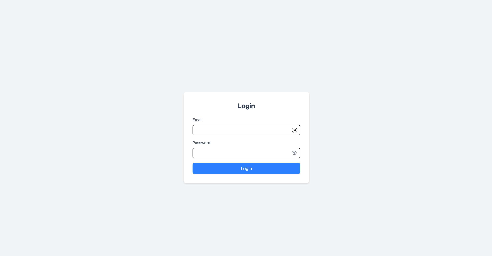
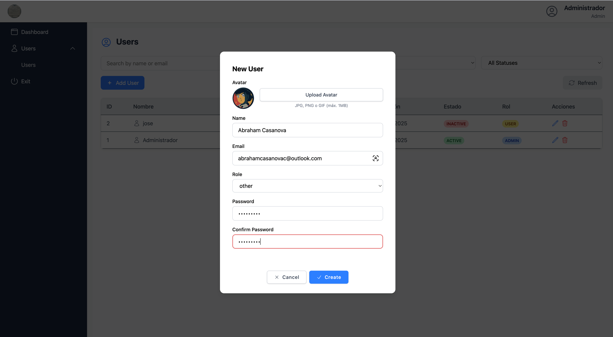
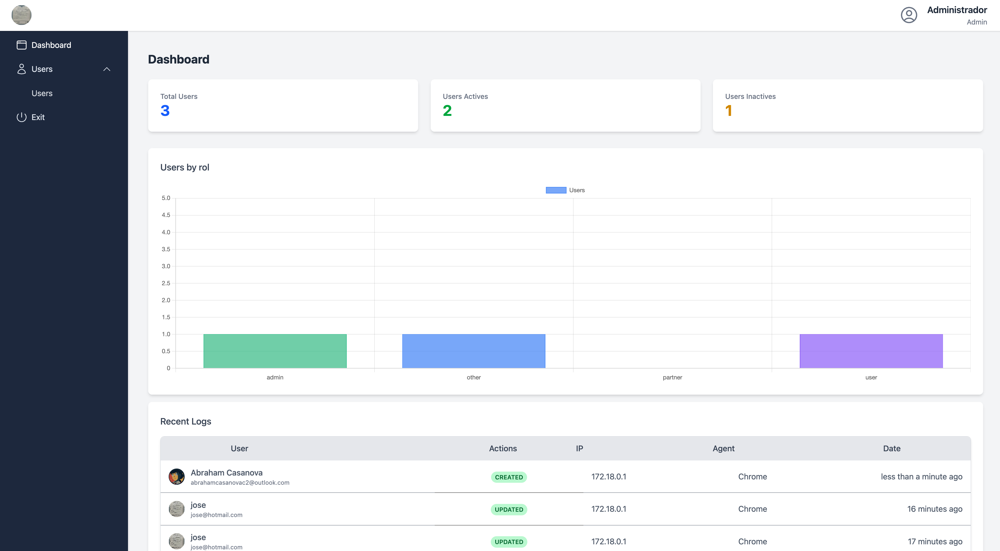

# SPA Project

This repository contains a Single Page Application with a separated frontend and backend architecture.

## Technologies

### Frontend
- Vue 3
- Typescript
- Axios
- Tailwind
- Chart.js

### Backend
- Laravel 12
- PostgreSQL
- JWT Authentication
- RESTful API

<p align="center">
  
</p>

<p align="center">
  
</p>

<p align="center">
  
</p>

## Project Structure

### Frontend

```
frontend/
├── public/            # Static files
├── src/               # Source code
│   ├── api/           # Api (login and utils)
│   ├── components/    # Reusable UI components
│   ├── interfaces/    # Interfaces
│   ├── router/        # Routers
│   ├── store/         # State management
│   ├── styles/        # Global styles
│   ├── App.js         # Main app component
│   └── index.js       # Entry point
├── package.json       # Dependencies and scripts
```

### Backend

```
backend/
├── app/
│   ├── Enums/                      # Enums (e.g. Status, Roles)
│   ├── Http/
│   │   ├── Controllers/            # Route controllers
│   │   ├── Middleware/             # Custom middlewares
│   │   ├── Requests/               # Form request validation
│   │   └── Resources/              # API Resources / Transformers
│   ├── Models/                     # Eloquent models
├── config/                        # Configuration files
├── database/
│   ├── factories/                 # Model factories
│   ├── migrations/                # DB migrations
│   └── seeders/                   # Seeders for test data
├── public/                        # Public folder (entry point: index.php)
├── routes/
│   ├── api.php                    # API routes
│   ├── web.php                    # Web routes
│   └── console.php                # Artisan custom commands
├── storage/                       # Logs, file uploads, etc.
├── .env                           # Environment variables
├── composer.json                  # PHP dependencies
├── package.json                   # JS dependencies (for Vite, etc.)
```


## Getting Started

### Prerequisites
- Node.js (v14 or higher)
- Docker and Docker Compose
- Git

### Development Setup

1. Clone the repository:
```bash
git clone https://github.com/abrahamcasanova/spa.git
cd spa
```

2. Environment configuration
### Copy environment file for backend
```bash
cp backend/.env.example backend/.env
```

### Copy enviroment file for frontend
```bash
cp frontend/.env.example frontend/.env
```

### Default Docker configuration
```bash
- DB_CONNECTION=pgsql
- DB_HOST=db
- DB_PORT=5432
- DB_DATABASE=spa_project
- DB_USERNAME=user
- DB_PASSWORD=password
```

3. Run migrations and seed database (first time setup)
```bash
docker-compose exec app php artisan migrate:fresh --seed
```


## Docker Setup

The entire application can be run using Docker:

1. Make sure Docker and Docker Compose are installed on your system

2. From the root directory, build and start the containers:
```bash
docker-compose up --build
```

3. Access the application:
    - Frontend: http://localhost:5173
    - Backend API: http://localhost:8080
    Default credentials:
        - abrahamcasanovac@outlook.com/topsecret

## API Documentation

The backend API is available at `/api/` with the following endpoints:

## Public routes
- `POST /api/login` - User login

## Protected routes (Middleware)
- `GET /api/users` - Get all users
- `POST /api/users` - Create a new user
- `GET /api/users/{id}` - Get a specific user
- `PUT /api/users/{id}` - Update a user
- `DELETE /api/users/{id}` - Delete a user
- `POST /api/users/{user}/image` - Upload avatar image for a user
- `POST /api/logout` - Log out the user
- `GET /api/status` - Get list of possible statuses
- `GET /api/roles` - Get list of available roles
- `GET /api/dashboard/resume` - Get summarized data for the dashboard

## Run test back
- composer test

## License

This project is licensed under the MIT License
